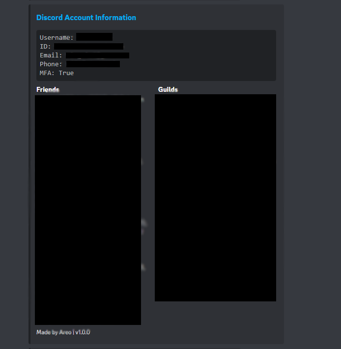
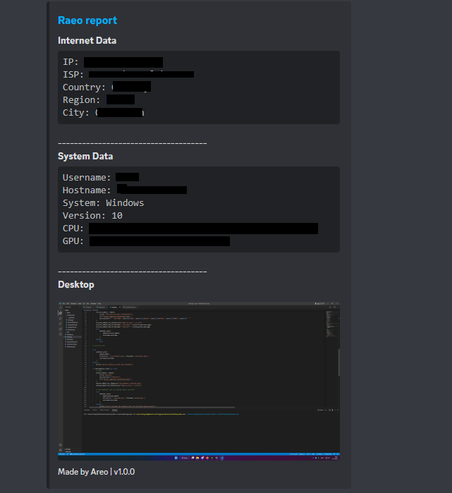
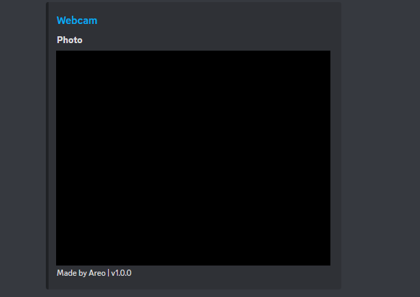

# Raeo

Trojan written in python. Raeo will send the grabbed information via discord webhook.

## Features
- Discord token info
    - Token
    - User information
    - Email
    - Phone
    - Guilds
    - Friends
- Webcam
    - Webcam photo
- System info
    - User
    - System
    - Network
    - Desktop screenshot

## Install
1. Install [Python 3.9 or above](https://python.org)
2. Edit the **config.py** (components/config.py) and fill it with your infos
3. Open the CMD and type 
`py -3 builder.py`
4. Check out the **dist** folder

## Example

## License

Raeo is licensed under the <a href="https://mit-license.org/">MIT License</a>.

## Found a bug or have some questions?
Join our [Discord](https://discord.gg/9VSEt26ngV)
